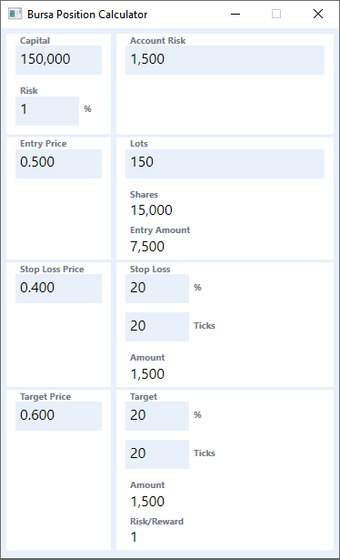
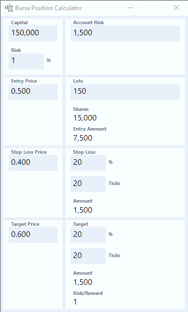

# Bursa Position Calculator

Bursa Position Calculator helps you to determine your position size based on your **Entry Price** and **Stop Loss Price**. It can also determine your expected profit based on **Target Price**.

Additionally, you can make small adjustments with Price or Ticks using the <kbd>↑</kbd> and <kbd>↓</kbd> arrow keys to see how it affects the results.

This app only supports buying long and does not support selling short.

The calculator is grouped into two columns. The left column has the input fields you normally use to calculate your position size. The right column shows the output results based on the left column input fields. Some of the left column result fields can be changed to effect changes in the left column.

## Left Column

The left column has the input fields to help you calculate your position sizes.

## Right Column

You usually don't need to make changes to any input fields in the right column. But you can change the values to see how it affects values on the left columns.

*e.g.* changing **Account Risk** will affect **Risk** based on your **Capital**.

The list below shows how inputs in the left column will affect inputs in the right column.

- Account Risk -> Risk
- Lots -> Stop Loss Price
- Stop Loss % -> Stop Loss Price
- Stop Loss Ticks -> Stop Loss Price
- Stop Loss % -> Target Price
- Stop Loss Ticks -> Target Price

## Making Small Adjustments to Entry Price, Stop Loss Price & Target Price

You can use the <kbd>↑</kbd> and <kbd>↓</kbd> arrow keys to adjust prices up or down by one tick size at a time.

The tick size depends on the price and is determined by Bursa Malaysia.

| Price Range | Tick Size |
|-------------|-----------|
| Below RM1.00 | RM0.005 |
| RM1.00 to RM9.99 | RM0.01 |
| RM10.00 to RM99.98 | RM0.02 |
| RM100 above | RM0.10 |

*e.g.* Make small adjustments to **Entry Price** to determine how it affects your **Entry Amount** and the number of **Lots** you will be purchasing.

## Making Small Adjustments to Stop Loss Ticks & Target Ticks

Likewise, you can use the <kbd>↑</kbd> and <kbd>↓</kbd> arrow keys to the number of ticks up or down by one tick size at a time.

## Visual Feedback

Any input field that changes will flash in blue.

Invalid inputs and erroneous values are shown in red.

## Navigation

<kbd>→</kbd>	Next input field

<kbd>shift →</kbd>	Previous input field

<kbd>alt [hotkey char]</kbd>	Sets focus to the input field with underlined [hotkey char]

## Want to Contribute?

Yeah, the UX isn't the nicest. The front end runs on WPF. If you're a UX designer and would like to contribute, please reach out. Cheers!

### The Usual Software Disclaimer

This SOFTWARE PRODUCT is provided by THE PROVIDER "as is" and "with all faults." THE PROVIDER makes no representations or warranties of any kind concerning the safety, suitability, lack of viruses, inaccuracies, typographical errors, or other harmful components of this SOFTWARE PRODUCT. There are inherent dangers in the use of any software, and you are solely responsible for determining whether this SOFTWARE PRODUCT is compatible with your equipment and other software installed on your equipment. You are also solely responsible for the protection of your equipment and backup of your data, and THE PROVIDER will not be liable for any damages you may suffer in connection with using, modifying, or distributing this SOFTWARE PRODUCT.
